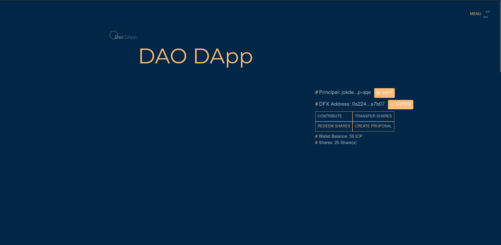

# ICP DAO DAPP

## Disclaimer

This is a test contract and should not be used in production.

This DAO contract:

- Collects investors money (ICP) & allocate shares
- Keep track of investor contributions with shares
- Allow investors to transfer shares
- Allow investment proposals to be created and voted
- Execute successful investment proposals (i.e send money)
- The number of votes an investor has is equivalent to the number of shares the investor has.

## How to deploy canisters

- Start the Local Internet Computer

    ```bash
    dfx start --background --clean
    ```

- Deploy the Ledger Canister

    ```bash
    npm run deploy:ledger
    ```

- Deploy the Internet Identity Canister

    ```bash
    npm run deploy:identity
    ```

- Deploy the DAO Backend Canister

    ```bash
    # contribution time is entered in days for testing purposes
    # vote time is entered in minutes for testing purposes
	# quorum is set between 0 and 100
	
	# run with dfx and set your contributionTime, voteTime and quorum
	dfx deploy dfinity_js_backend --argument '(record {contributionTime = <time in days>; voteTime = <time in minutes>; quorum = <pass %>})'

	# or run using npm with preset values for contributionTime, voteTime and quorum
	# contributionTime = 365 days
	# voteTime = 15mins
	# quorum = 70%
	npm run deploy:backend

    ```

- Deploy the DAO Frontend Canister

    ```bash
    npm run deploy:frontend
    ```

## Minting Tokens to your account

This next step shows how to mint icp tokens from the locally deployed Ledger canister.

- Copy your dfx address from the dao dapp frontend.
    
- Run the mint script.

    ```bash
    # npm run mint:tokens <amount in e8s> <amount> <dfx address>
   npm run mint:tokens 5_0000_0000 0a224323dad30bd7587e33534b54acd43496ff4b0318c4f89edaaa3d50ea7b07
    
    # N/B: This mints 5 ICP tokens from the locally deployed ledger to the address.
    ```